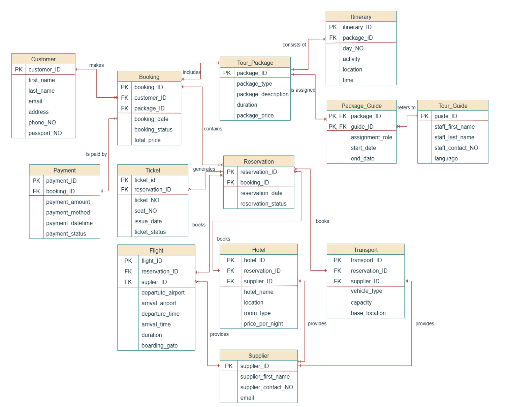
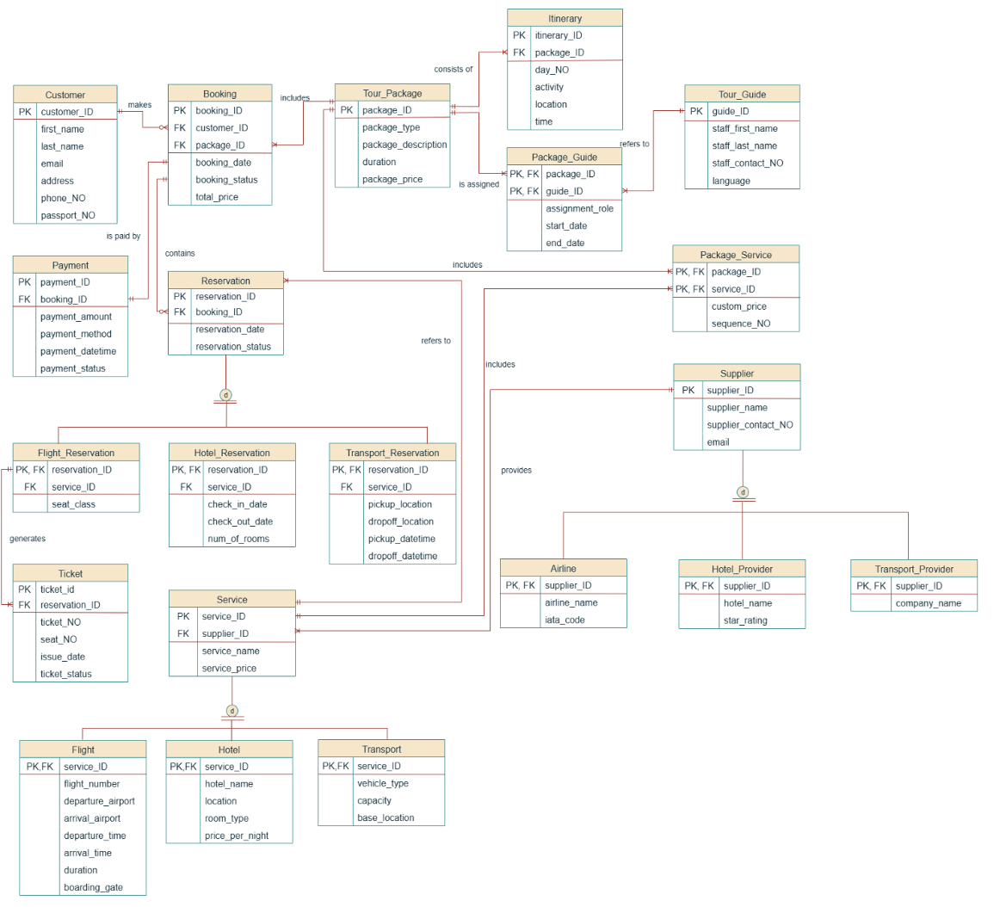

# DIY Holiday: Enterprise Booking & Reservation Database ✈️🏨

## 📌 Project Overview
An enterprise relational database system built with Oracle SQL and PL/SQL to manage tourism bookings, service reservations, and automated financial processing. Designed for "DIY Holiday," this centralized system streamlines travel operations by integrating tour package logistics with multi-vendor flight, hotel, and transport services.

## 💼 Business Impact
This database architecture ensures data integrity across complex, multi-vendor travel bookings. By automating payment validations and generating real-time revenue analytics, it reduces manual data entry errors and provides actionable business intelligence for tourism management.

## 🛠️ Tech Stack & Skills
* **Languages:** Oracle SQL, PL/SQL
* **Concepts:** Relational Database Design, Entity-Relationship Modeling (ERD/EER), Data Normalization, ACID Transactions
* **Database Objects:** Tables, Views, Advanced Queries, Stored Procedures, User-Defined Functions

## 📊 Database Architecture

## 💡 Key Features & My Contributions
As a core database designer and developer on this project, my specific focus was on building the **Financial Processing and Revenue Analysis modules**:
* **Automated Transaction Logic:** Developed PL/SQL stored procedures ([`add_payment.sql`](./sql_scripts/procedures/add_payment.sql)) with multi-branch validation to enforce business rules and prevent orphaned financial records.
* **Revenue & Spending Analysis:** Engineered PL/SQL functions ([`get_total_package_revenue.sql`](./sql_scripts/functions/get_total_package_revenue.sql), [`get_customer_spending_level.sql`](./sql_scripts/functions/get_customer_spending_level.sql)) to aggregate financial data and automate customer segmentation.
* **Advanced Data Retrieval:** Wrote complex SQL queries ([`customer_revenue_queries.sql`](./sql_scripts/queries/customer_revenue_queries.sql)) utilizing subqueries and relational filtering to extract verified, high-priority revenue data for business intelligence reporting.

## 📂 Technical Documentation
For a deep dive into the system requirements, business rules, and complete data dictionary, please review the final project report:
* [📥 View the Full DIY Holiday Technical Report (PDF)](./docs/diy_holiday.pdf)

## Author

**Boon Jia Xuan**

Bachelor of Computer Science (Honours)

Universiti Tunku Abdul Rahman (UTAR)
